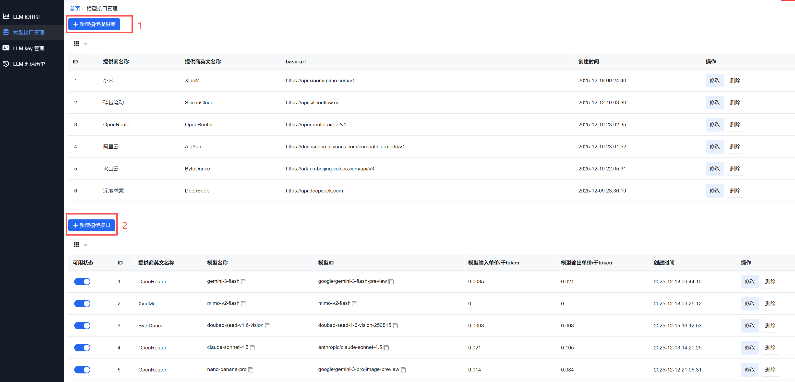
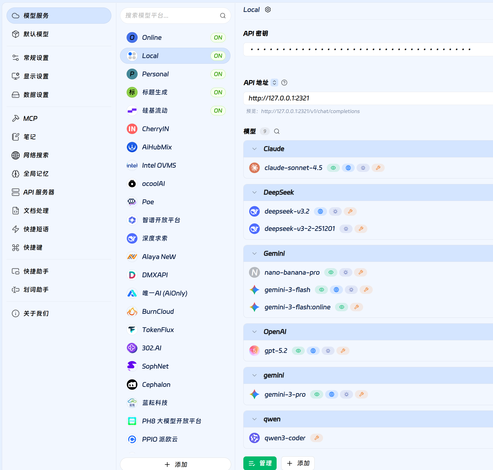
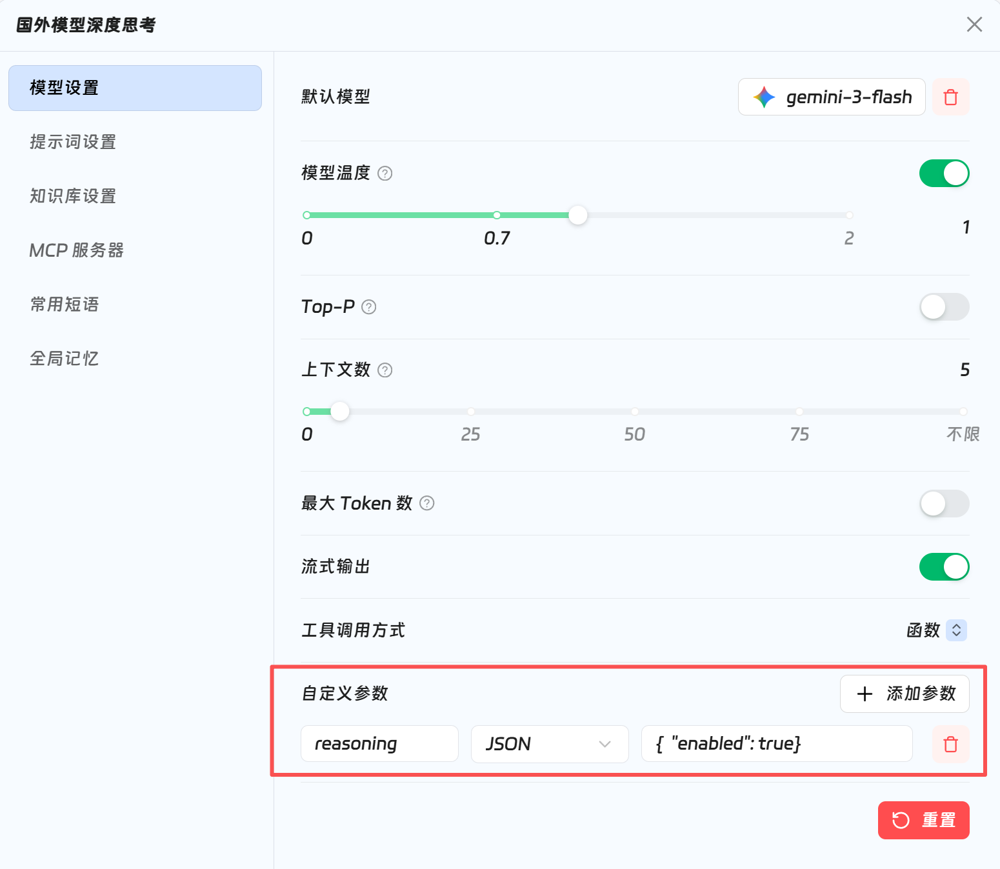
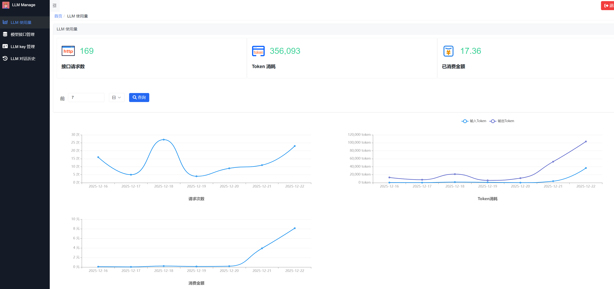
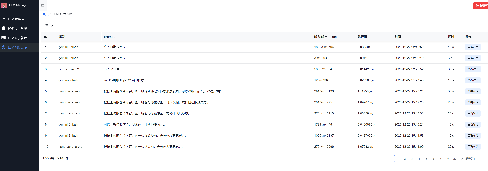

# 🎆Personal LLM API

Personal LLM API 是一款轻量级的 LLM 接口服务，与 [one-api](https://github.com/songquanpeng/one-api) 相比，本项目更加简洁易用，专为个人用户打造统一的 LLM 接口管理方案。基于 Python 开发，采用 FastAPI 框架实现高性能接口服务，后台管理界面使用 amis 低代码开发，无需复杂的前端技术即可快速构建管理控制台。

**🚀为什么要开发这样的项目：**
- **极致的交互适配：** 本项目深度优化了流式输出协议，是 Cherry Studio 等高颜值客户端的绝佳拍档。完美支持“打字机”流式响应，让每一行丝滑的输出都能匹配其精致的主题与字体设计，打造沉浸式对话体验。
- **多模型聚合调度：** 市面上的大模型接口提供商非常多，优惠力度也有差异，本项目统一管理自己的 LLM 接口，能够更方便地进行使用、切换和监控。
- **高度自由：** 考虑到个人使用场景，使用模块化设计，本项目能够很方便的进行二次开发扩展。

**项目特点：**
- 🧿极简架构：核心代码精简，易于理解和部署
- 🐍Python 原生：全栈 Python 实现，降低技术栈复杂度
- 📜低代码后台管理：基于 [amis](https://aisuda.bce.baidu.com/amis/zh-CN/docs/index) 构建的管理界面，可视化配置更高效
- 🛞高度可扩展：后台管理支持轻松添加新的模型提供商和接口；轻松扩展定制化代码与功能。
- 👩‍💻个人友好：资源占用低，适合个人服务器部署，运行 Python 入口文件即可。
- 📱可搭配各种 LLM 对话客户端：可与 [Cherry studio](https://www.cherry-ai.com/) 、[Lobe-Chat](https://lobechat.com/chat)、[ChatBox](https://chatboxai.app/zh/)等应用无缝集成，扩展应用场景

支持多种主流模型提供商（火山云、阿里云、硅基流动、OpenRouter 等），兼容 OpenAI API 规范，提供流式/非流式响应、Web 搜索(火山云response接口)集成等核心功能，是个人开发者快速部署统一 LLM 接口的理想选择。
        


## 特性

- ✅️支持 `/v1/chat/completions`和`/chat/completions`的 OpenAI 接口规范。
- ✅️支持火山云`web search`的`response`接口转换成普通的`chat`接口方式，易于接入`Cherry studio`等客户端。
- ✅️支持`Nano Banana Pro`。
- ✅️支持大部分的 LLM 服务提供商。
- ✅️支持相同模型下的轮询负载均衡。
- ✅️支持后台管理界面(使用统计、模型管理、对话历史、key 管理等)。
- ✅️支持`sqlite`或`mysql`存储。
- ✅️支持设置`proxy`代理访问。
- ✅️方便个人使用和部署，不支持多租户设计。
- ✅️后台界面使用 [amis](https://aisuda.bce.baidu.com/amis/zh-CN/docs/index) 低代码进行构建，方便扩展。
- 🔲计划开发使用 [seekdb](https://www.oceanbase.ai/zh-CN/) AI 原生数据库的 RAG 应用及接口服务...
- 🔲计划支持RAG应用和相应接口...
- 🔲计划支持 prompt 管理功能...


## 技术栈

**前端:** amis-v6.13.0、TailwindCSS

**服务端:** FastAPI

**数据库:** SQLite、MySQL


## Demo(后台界面)

🧷[http://llmdashboard.demo.dx3906.info/dashboard/login#/api-manage](http://llmdashboard.demo.dx3906.info/dashboard/login#/api-manage)

🔑登录用户名和密码：
```bash
test
12345678
```


## 部署

项目目录说明
```bash
├── app_config.yaml        # 项目配置文件
├── config.py              # 配置加载模块
├── init.py                # 数据库和模型初始化
├── main_personal_llm.py   # 项目入口文件
├── requirements.txt       # 项目依赖
├── backend/               # 后端API模块
│   ├── api_manage.py      # API管理
│   ├── backend_api.py     # 后端API路由
│   ├── chat.py            # 聊天相关接口
│   └── llm_usage.py       # LLM使用统计
├── dashboard/             # 后台管理界面
│   ├── index.html         # 主页面
│   ├── login.html         # 登录页面
│   ├── reset_password.html   # 重置密码页面
│   ├── aside.json         # 侧边导航
│   └── pages/             # 页面配置
├── db/                    # 数据库相关
│   ├── init_mysql.sql     # MySQL初始化脚本
│   ├── init_sqlite.sql    # SQLite初始化脚本
│   ├── llm.db             # SQLite数据库文件
│   └── version            # 版本
├── logs/                  # 日志文件目录
├── service/               # LLM服务实现
│   ├── byte_llm.py        # 字节跳动LLM服务
│   ├── llm_service.py     # 基础LLM服务
│   ├── open_router_llm.py # OpenRouter LLM服务
│   └── qwen_llm.py        # 阿里云通义千问服务
├── static/                # 静态资源
└── utils/                 # 工具函数
    ├── db_client.py       # 数据库客户端
    ├── logger.py          # 日志工具
    ├── mysql_client.py    # MySQL客户端
    ├── sqlite_client.py   # SQLite客户端
    └── util.py            # 通用工具
```

👉️1.所需 Python 版本：
```bash
python >= 3.9
```

👉️2.使用 pip 安装所需 Python 包：

```bash
pip install -r requirements.txt
```

👉️3.根据自己的环境，修改配置文件`app_config.yaml`
```bash

# 数据库配置
database:
  # 数据库类型，可选 sqlite \ mysql
  # - sqlite: 使用 SQLite 数据库，需要指定 db_path
  # - mysql: 使用 MySQL 数据库，需要指定 host, port, user, password, database
  use_db: sqlite

  sqlite:
    db_path: ./db/llm.db

  mysql:
    host: 127.0.0.1
    port: 3306
    user: root
    password: 123
    database: db

# 代理设置，用于访问国外大模型服务
proxy:
  # 代理类型，可选 system \ manual \ none
  # - system: 使用系统代理，自动获取操作系统代理设置
  # - manual: 手动配置代理，需要指定 url
  # - none: 不使用代理
  type: none
  url: http://127.0.0.1:7890

```

👉️4.运行 main 入口 Python 文件：
```bash
python3 main_personal_llm.py
```
或，使用后台运行方式
```bash
nohup python3 main_personal_llm.py &
```

👉️5.然后通过浏览器访问后台：
```bash
http://127.0.0.1:2321/dashboard
```

👉️6.在后台配置 LLM 提供商和相应的模型即可：

`model_name`参数可选用：`模型名称`或`模型ID`




## Chat Completion 接口
支持`/chat/completions`或`v1/chat/completions`对话补全接口，兼容性更强。

支持`Function Calling`以及`web search(联网搜索)`。

接口文档可详见各大平台文档：[https://api-docs.deepseek.com/zh-cn/api/create-chat-completion](https://api-docs.deepseek.com/zh-cn/api/create-chat-completion)

### 🌍️web search(联网搜索)
1. **火山云(方舟)平台模型**
官方的`web search`只支持`response`接口方式使用，该项目的`/chat/completions`接口已完成兼容，在调用火山云 LLM 模型接口时，只需要额外传入`web_search=true`参数即可使用。

2. **阿里云(百炼)平台模型**
只需要传入`enable_search=true`参数即可，详见：👉️[文档链接](https://help.aliyun.com/zh/model-studio/web-search?spm=a2c4g.11186623.help-menu-2400256.d_0_2_8_0.284976b8nevTcQ)

3. **OpenRouter平台模型**

只需要在`模型名称`或`模型ID`后面添加`:online`即可，例如：
```bash
google/gemini-3-flash-preview:online
```
详见 OpenRouter [官方文档](https://openrouter.ai/docs/guides/features/plugins/web-search)


## 可搭配🍓 Cherry studio 使用

1. 在模型服务下进行相应配置



2. 也可以在助手里配置每次对话时额外的请求参数，例如控制模型的深度思考。




## 后台功能展示

1. 可查看 LLM 接口使用量和统计信息



2. 可管理模型接口和key

3. 可查看对话历史记录


## 作者

- [@Stark 博客](http://era.dx3906.info)
- 微信公众号：第五纪元


